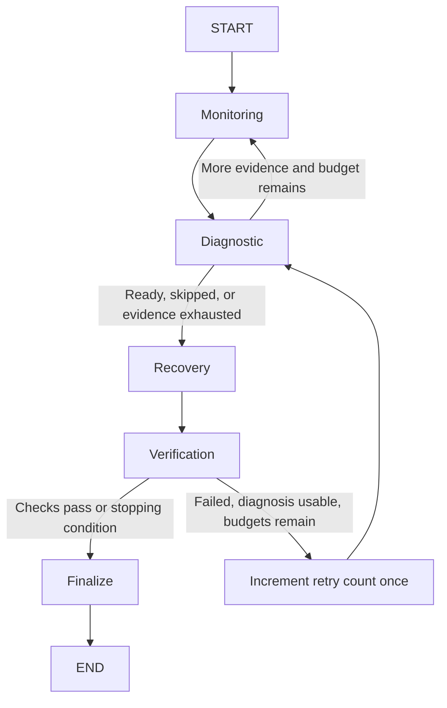

# IncidentOps

IncidentOps is a course project that coordinates four specialist LangGraph nodes:
Monitoring, Diagnostic, Recovery, and Verification. It investigates a local
FastAPI/authentication/SQLite system, applies allowlisted repairs, independently
tests the result, and retries within explicit limits.

The live Diagnostic Agent uses Gemini through LangChain structured output; the
configured default model is **`gemini-3.5-flash-lite`**. Gemini identifies the cause,
requests additional evidence when needed, and recommends a repair. Recovery
validates that recommendation and executes the corresponding tool. Monitoring,
Recovery, and Verification do not make separate LLM calls. This implementation has
four specialist workflow roles and one role powered directly by an LLM; it should
not be described as four independently reasoning LLM agents.

The demonstration follows a visible sequence: healthy portal -> manually triggered
fault -> reported symptoms -> investigation -> repair -> independent verification.
A report describes symptoms; it never creates a fault. Repairs clear controlled
application fault flags; they do not restart operating-system processes.

## Quick start: backend and UI

Use Python **3.12**. From the repository root in PowerShell:

```powershell
py -3.12 -m venv .venv
.\.venv\Scripts\Activate.ps1
python -m pip install -r requirements.txt
python -m pip check
if (-not (Test-Path .env)) { Copy-Item .env.example .env }
python -m uvicorn incidentops.api:app --host 127.0.0.1 --port 8000
```

Open **http://127.0.0.1:8000**. The same backend serves the UI; there is no separate
frontend build. API documentation is at http://127.0.0.1:8000/docs.

Run setup once. If the page already opens, the server is already running; do not
start another process on port 8000. Opening the page does not call Gemini. The
selected execution mode determines what happens when you click **Run investigation**.

| Mode | Processes required | Diagnosis |
| --- | --- | --- |
| Isolated demo (UI default) | IncidentOps on 8000 | Deterministic rules, no Gemini usage |
| Local services / Gemini | IncidentOps on 8000, application on 8001, auth on 8002 | Gemini API call |
| CLI without flags | CLI process only | Observation-only mock; diagnosis skipped |

If PowerShell blocks activation, use `.\.venv\Scripts\python.exe` in place of
`python` in the commands below. Activation is a convenience, not a requirement.

The default **Isolated demo** runs the actual FastAPI service endpoints, fault
store, SQLite database, monitoring, recovery, verification, and graph in a temporary
environment. HTTP is dispatched in process using TestClient/MockTransport. Its
Diagnostic Agent is an explicit deterministic test double that reads observations;
it does not call Gemini or use the scenario label to choose a diagnosis. Demo
results demonstrate integration, **not LLM reasoning quality**. No key or separately
running services are needed. The UI labels the mode and shows every completed step,
state update, recovery attempt, verification check, retry, and final outcome.

The original observation-only mock remains available:

```powershell
python -m incidentops.main
```

For the complete deterministic workflow:

```powershell
python -m incidentops.main --demo auth_down
python -m incidentops.main --demo multiple_faults
python -m incidentops.main --demo persistent_auth
```

On macOS/Linux use `python3.12`, `source .venv/bin/activate`, and `.venv/bin/python`.

## Live Gemini mode and local services

Set `GEMINI_API_KEY` in the ignored `.env` file and set `LLM_MODEL` to a Gemini
model your key can access (the project default is `gemini-3.5-flash-lite`). For the
IPv4 commands below, set these URLs in `.env` to avoid Windows `localhost`/IPv6
connection delays:

```dotenv
INCIDENTOPS_API_URL=http://127.0.0.1:8001
INCIDENTOPS_AUTH_URL=http://127.0.0.1:8002
```

Then initialize the database from the repository root:

```powershell
python -m environment.database
```

Run each command in its own terminal from the repository root, using the virtual
environment. Keep each process running. If port 8000 is already serving the quick
start UI, start only the two missing services:

```powershell
python -m uvicorn environment.auth_service.main:app --host 127.0.0.1 --port 8002
python -m uvicorn environment.app_service.main:app --host 127.0.0.1 --port 8001
python -m uvicorn incidentops.api:app --host 127.0.0.1 --port 8000
```

These are three services, not a requirement for three visible terminals; processes
already running in the background also work. To stop a foreground service, press
Ctrl+C in its terminal. After a computer restart, start the services again.

For an optional CLI demonstration, use another activated terminal:

```powershell
python -m environment.fault_controller inject auth_down
python -m incidentops.main --local "Users cannot log in"
python -m environment.fault_controller status
```

Alternatively select **Local services · Gemini** in the UI. This mode observes and
repairs the configured running services; the demo scenario dropdown is hidden and no
fault is injected by the workflow. Faults can be reset explicitly with
`python -m environment.fault_controller reset`. All processes must share the same
`.env`/database paths. Services observe persistent flag changes without restart.
Restart affected services after code or `.env` changes. These commands do not
enable automatic reload. Restarting IncidentOps clears its in-memory incidents
and checkpoints; persistent fault flags remain until repaired or cleared.

For the visible fault-to-recovery demo, first select **Local services | Gemini**.
The Employee Portal makes a fresh fixed-identity sign-in and profile probe, so a
healthy environment shows a working profile. Select a supported fault in **Controlled
fault lab** and click **Trigger fault**. The portal then shows the actual failure.
Write a symptom report and run the investigation. Monitoring and Verification make
their own fresh requests; the agents do not receive the selected fault flag as
evidence. After the run, the portal probes again, while the workflow verdict comes
from independent Verification. Click **Clear faults** to return the lab to healthy.
UI/API fault changes are rejected during an investigation to keep its evidence
stable. The separate fault-controller CLI does not share that lock; use it between runs.
The portal uses the fixed `demo-token` identity; its password display is decorative
and accepts no personal credentials. Local service probes require ports 8001/8002
and the initialized database; an unreachable service is shown as a failure, not a
healthy portal. The incident report describes the problem and never triggers a fault.

Missing keys or failed diagnosis cannot authorize recovery. Unknown observations
must not be treated as confirmed healthy or failed services. Invalid Gemini
structured output is retried once using the same evidence and schema instructions.
If both attempts fail, actionable diagnosis fields are cleared and an error is
recorded. Transport/provider retries are disabled; the structured-output retry
is separate. Live model calls require valid credentials and model access;
a successful offline evaluation is not proof of those external prerequisites.

## Architecture and responsibilities



The legacy simulated observation-only mode follows the four nodes but skips live
analysis/actions/checks and ends `monitoring_only`, never `resolved`.
There are six graph nodes: four specialist roles plus `retry` and `finalize`.

| Agent | Owns | Tools / output |
| --- | --- | --- |
| Monitoring | Current objective observations | API/auth/DB health, profile probe, logs, metrics |
| Diagnostic | Probable root cause and supported recommendation | Gemini `with_structured_output(Diagnosis)`; no mutation tools |
| Recovery | Controlled remediation | Four targeted flag-clearing actions; attempt accounting |
| Verification | Independent post-action evidence | Fresh API/auth/DB health, login, and profile checks |

Monitoring now probes `/profile` before reading logs. This exposes a current
configuration fault even when independent service health is green and no user has
made a previous request. Verification repeats checks after recovery because
pre-recovery observations cannot prove success. Health adapters may share code,
but verification always executes fresh I/O; it never trusts Recovery's result.

On verification failure, diagnosis receives fresh verification health/profile
results. Older logs/metrics are omitted from its current evidence. If it needs more
evidence, the existing Monitoring node refreshes the snapshot within its own budget.
No agent parses another agent's natural-language explanation to choose a tool.

## State and module contracts

`incidentops/state.py` defines the Pydantic `IncidentState`. Nodes accept this
model and return only changed fields. Existing field names are retained.
The model includes strings, booleans, integers, floats, lists, dictionaries, and
nested Pydantic results. Optional diagnosis/recovery/verification fields start as
`None`; confidence is bounded to 0-1, counters are nonnegative, and each collection
has an independent default factory.

| Fields | Meaning |
| --- | --- |
| `incident_id`, `user_report` | Incident identity and request |
| `service_status`, `profile_check`, `logs`, `metrics` | Latest available observations |
| `observation_source`, `evidence_source` | Local/simulated provenance; monitoring/verification freshness |
| `monitoring_complete`, `collection_errors` | Baseline collection attempts finished; current collection errors, if any |
| `suspected_component`, `suspected_root_cause`, `diagnosis_confidence`, `diagnosis_evidence` | Validated structured diagnosis |
| `recommended_action`, `needs_more_evidence`, `requested_evidence` | Recovery/evidence contract |
| `recovery_action`, `recovery_result`, `recovery_attempts`, `max_recovery_attempts` | Actual attempted action, outcome, and action budget |
| `verification_result`, `verification_passed` | Typed independent check results and verdict |
| `retry_count`, `max_retries` | Verification-driven retries |
| `evidence_attempts`, `max_evidence_attempts` | Extra evidence passes, default maximum 2 per incident |
| `tool_calls` | Counts at the agent-tool boundary; includes attempted LLM calls |
| `incident_resolved`, `final_status`, `termination_reason` | Explicit terminal outcome |
| `errors`, `execution_history` | Append-only errors and execution events |

Errors/history append only new entries; tool counts add by key. Other fields use
replacement semantics. Monitoring invalidates stale verification when obtaining a
new snapshot. Verification replaces current health/profile evidence. Each API/UI
step retains its own state snapshot, so earlier observations remain inspectable.
Checkpoint payloads use dictionaries, avoiding custom-object deserialization.

`Diagnosis` restricts components, action identifiers, confidence bounds, and
supported evidence requests. Action/component mismatches and recommendations
without evidence are invalid. `RecoveryResult` describes an action outcome;
`VerificationResult` contains five typed `CheckResult` records, a verdict, summary,
and remaining problems. Unknown, malformed, or failed checks prevent resolution.

The live structured-output call is:

```python
structured_llm = llm.with_structured_output(Diagnosis, method="json_schema")
diagnosis = Diagnosis.model_validate(structured_llm.invoke(messages))
```

See [the schema](incidentops/schemas/diagnosis.py) and
[Diagnostic implementation](incidentops/agents/diagnostic_agent.py). Fields such as
`confidence` and `evidence` map to `diagnosis_confidence` and `diagnosis_evidence`
in shared state. The isolated demo constructs this schema from rules; it does not
demonstrate LLM structured-output execution. `diagnose.llm` counts attempted model
calls, including the parsing retry. Exact token usage and cost are not recorded.

## Retry and terminal semantics

- `max_retries=2` means **one initial cycle plus at most two retries**.
- The utility `retry` node increments `retry_count` exactly once before returning
  to Diagnostic. It is not a fifth agent.
- `max_recovery_attempts=3` separately limits real action attempts, including
  failed actions. Skipped actions do not consume that budget.
- Extra evidence collection is limited to two additional passes per incident.
- Failed verification with a valid diagnosis and remaining budgets retries.
  Missing/invalid diagnosis, exhausted evidence, exhausted recovery attempts, or
  exhausted retries terminate without an infinite loop.
- A failed verification can retry even when recovery was skipped; the retry counter
  bounds that path independently of the action counter.
- `resolved` requires all five independent checks to pass, including login and the
  authenticated database-backed profile. This also handles the healthy/no-action
  case. Recovery's own success/failure message is not the resolution criterion.
- `unresolved` includes a reason such as `diagnosis_failed`, `evidence_exhausted`,
  `recovery_limit`, `retries_exhausted`, or `workflow_error`.

The shared runner sets a LangGraph recursion safety cap above the expected bounded
workflow size. Callers invoking a compiled graph directly with unusually large
custom budgets should also supply a suitable `recursion_limit`.

Finalization gives passing verification precedence. If diagnosis fails but every
independent service check passes, the current code can finish `resolved` with the
diagnosis error still recorded. This means the system was verified healthy; it
does not mean Gemini successfully diagnosed or repaired it.

## Supported scenarios

| Scenario | Initial health (API / auth / DB) | Profile | Recovery |
| --- | --- | --- | --- |
| `healthy` | true / true / true | 200 | None; verification resolves |
| `auth_down` | true / false / true | 503 | `restart_auth_service` |
| `database_down` | true / true / false | 500 | `restore_database_availability` |
| `api_degraded` | false / true / true | 503 | `reset_application_state` |
| `wrong_db_config` | true / true / true | 500 | `restore_database_configuration` |
| `multiple_faults` | true / false / false | 503 initially | Auth, then DB after failed verification |
| `persistent_auth` | true / false / true | 503 | Deliberately blocked action; bounded unresolved outcome |

The last two are preset isolated demonstration/evaluation scenarios. Local fault
controls can also activate multiple supported faults by triggering them one after
another. Deliberately blocked recovery belongs to the isolated `persistent_auth`
scenario. Faults are
application-layer simulations: no real process is killed and no database is
damaged. Recovery clears only its targeted flag. An actual stopped process or
corrupt database is not repaired by these tools and must not be reported resolved.

## Configuration

Process variables override `.env`. Relative data paths resolve against the project
root. `.env.example` contains placeholders only.

| Variable | Default |
| --- | --- |
| `GEMINI_API_KEY` | Empty |
| `LLM_MODEL` | `gemini-3.5-flash-lite` |
| `INCIDENTOPS_MAX_RECOVERY_ATTEMPTS` | 3 |
| `INCIDENTOPS_MAX_RETRIES` | 2 (allowed 0–10) |
| `INCIDENTOPS_LLM_TIMEOUT_SECONDS` | 30 (provider retries disabled) |
| `INCIDENTOPS_API_URL` | `http://localhost:8001` |
| `INCIDENTOPS_AUTH_URL` | `http://localhost:8002` |
| `INCIDENTOPS_DATABASE_PATH` | `data/incidentops.db` |
| `INCIDENTOPS_FAULT_DATABASE_PATH` | `data/faults.db` |
| `INCIDENTOPS_HTTP_TIMEOUT_SECONDS` | 2 |

The seeded `demo` user and fixed `demo-token` are fixtures for this local lab, not
production credentials. Keys are excluded from API responses, and bundled
transport errors publish fixed messages or exception types, not raw bodies/keys.

## API, UI, and persistence

- `GET /` serves the UI; `/static/` serves its local CSS/JavaScript.
- `GET /api/config` returns scenarios, model name, and key-presence boolean only.
- `GET /api/lab/portal` probes the fixed demo login and, if it passes, the profile;
  returns their results and active fault flags. It does not call Gemini.
- `POST /api/lab/faults` accepts `{"fault":"api_degraded"}` (or another supported
  fault), enables that flag, and returns a fresh portal probe. Other flags remain set.
- `POST /api/lab/reset` clears all controlled flags and returns a fresh portal probe.
- `POST /api/incidents` accepts a validated report, mode, scenario, optional thread
  ID, and optional retry limit. It returns final state plus per-step snapshots and
  measured elapsed times.
- `POST /api/incidents/stream` accepts the same body and streams newline-delimited
  JSON events as work happens. The UI uses this endpoint; the original JSON endpoint
  remains compatible with existing clients.
- `GET /api/incidents/{thread_id}` reads a completed incident without rerunning it.
- `/docs` exposes the OpenAPI schema.

Example body:

```json
{"report":"Users cannot log in","mode":"demo","scenario":"auth_down","max_retries":2}
```

`MemorySaver` retains checkpoints within the backend process. The API retains the
latest 100 completed incidents and deletes checkpoints when evicting one. Existing
thread IDs return HTTP 409 instead of replaying accumulated state. A new server
process loses in-memory history; checkpointing is not durable database persistence.

For direct checkpoint inspection, retain the same compiled graph and thread ID:

```python
from incidentops.graph import build_graph
from incidentops.state import IncidentState

graph = build_graph()  # Observation-only mock for this memory example.
config = {"configurable": {"thread_id": "memory-example"}}
initial = IncidentState(incident_id="memory-example", user_report="Check services")
graph.invoke(initial.model_dump(), config)
snapshot = graph.get_state(config)
print(snapshot.values["final_status"])  # monitoring_only
print(len(list(graph.get_state_history(config))))
```

The UI's completed-incident lookup returns retained execution snapshots; it does
not resume the graph. Separate CLI invocations do not share in-memory checkpoints.

Run **one Uvicorn worker on loopback**. Workflows are serialized because live runs
share a fault store; a concurrent start receives HTTP 409, while read routes remain
available. This local course demo has no authentication/multi-tenant isolation and
is not intended for public deployment.

The UI shows the active agent, individual monitoring/verification checks, the
structured diagnosis request, the chosen recovery action, observed tool results,
retry transitions, and each completed node's state update **during execution**.
Its elapsed-time counter runs while waiting for Gemini or I/O. This is operational
progress and validated output, not an LLM's private reasoning or simulated typing.
Fast offline demos may finish almost immediately; live execution has no artificial
delay. The optional **Presentation walkthrough after execution** then replays the
returned snapshots at 800 ms per step, explicitly labeled as recorded playback.
Its timer shows the original execution time, not animation time. Use **Show final
result** to skip playback or **Replay recorded investigation** to repeat it without
rerunning tools or calling Gemini. Reduced-motion preferences disable automatic
walkthrough by default.

The simulated Employee Portal tells the application-side story. Before an isolated
demo run, it is explicitly labeled as a scenario preview. In local Gemini mode it
shows a live fixed-identity probe before and after manual fault changes and again
after the workflow. A working portal is a user-facing observation; only a final
`resolved` state with `incident_resolved` and `verification_passed` both true is
reported as an agent-verified resolution. Agent cards display observed results and actual
tool-call deltas; the topology uses monitoring/verification evidence. The before/
after table compares the first monitoring snapshot with independent verification,
with unobserved checks labeled honestly (Monitoring does not separately test login).
Retry cycles are built from actual steps, not a hardcoded repair order.

Use **Retrieve a completed incident** for a read-only lookup in this backend
process. The detailed timeline retains both partial updates and full snapshots.
See [the presentation guide](docs/demo-story.md) for the two recommended demos.

Stream events are `run_started`, `node_started`, `tool_started`, `tool_completed`,
`step_completed`, and `run_completed` (or a sanitized `run_failed`). Heartbeats keep
an idle stream active. Operational events contain node/tool identifiers and results;
completed steps contain the same validated snapshots as the original API. The
terminal event contains the full IncidentResponse, also available through GET.
Activity callbacks are separate from checkpoint state, so CLI and evaluation
behavior is unchanged. A disconnected browser does not cancel recovery or release
the run lock; the worker finishes and retains the result for GET lookup.

The fault-scenario selector is shown only in isolated demo mode, where it creates
faults in temporary test services. Gemini mode uses the current local environment.
An incident report describes symptoms; it does not create a fault or override tool
evidence. To demonstrate a live auth fault, use **Trigger fault** or
`python -m environment.fault_controller inject auth_down`, then investigate using
Gemini mode. A healthy environment can correctly finish without a repair.

## Tests and evaluation

```powershell
python -m pytest -q
python -m pip check
python -m evaluation.evaluate --output evaluation/results.json
```

If Windows temporary-directory permissions interfere, create `.pytest_cache` and
use a fresh directory under it with `--basetemp=.pytest_cache/my-run`.

The suite covers schemas, all four nodes, service tools, every supported scenario,
malformed responses, missing keys, tool/model failures, exact retry boundaries,
no-action retries, independent verification, API validation/concurrency, reducers,
checkpoint retrieval, and measured evaluation. LLM calls are mocked in unit and
integration tests; actual local-service endpoints and SQLite are exercised.

`evaluation/incidents.json` is a seven-case ground-truth dataset. The runner checks
monitoring accuracy, exact diagnosis component sequence, recovery action sequence,
verification correctness against post-run fault/profile evidence, final outcome,
retry count, agent-tool counts, extra observation passes, and latency. The measured
report identifies its mode. Exact component/action sequence scoring is deliberately
strict; a valid alternative recovery order can score lower in live evaluation.

To measure the actual configured model separately:

```powershell
python -m evaluation.evaluate --live --output evaluation/live-results.json
```

This explicitly calls Gemini and may incur API charges. It requires the key and
model access; there is no silent fallback. Live evaluation still uses isolated
local-service fixtures so it cannot alter a running demonstration environment.

## Troubleshooting

| Symptom | What to check |
| --- | --- |
| The page opens without running terminal commands | The services are already running. Choose the mode, then run an investigation. |
| Port 8000 is already in use | Use the existing server, or stop it before starting a replacement. |
| Trigger fault displays `Not Found` | The server may still have older Python routes loaded while serving new static files. Restart IncidentOps, then refresh the page. |
| Portal checks fail or time out | Start the app/auth services, initialize the database, check `.env` URLs and shared paths, and use `127.0.0.1` with the launch commands above. |
| Recovery is skipped and all checks pass | The environment is healthy. Trigger a fault first if you want to demonstrate a repair. |
| Diagnosis reports invalid structured output | One automatic schema retry is attempted. If both fail, no repair is authorized. Inspect the error and rerun; persistent failures require investigating the model/schema response. |
| A key is configured but diagnosis fails | Key presence does not prove model access, quota, or connectivity. Review the model configuration and recorded error. |
| Old thread ID is not found after restarting | In-memory history was cleared. Start a new investigation. |

### Check local services before a live demo

Select **Local services | Gemini** and click **Clear faults** in the UI, then run
these checks in PowerShell. They use the default local ports; adjust the URLs if
you configured different service addresses.

```powershell
Invoke-RestMethod -Uri http://127.0.0.1:8001/health
Invoke-RestMethod -Uri http://127.0.0.1:8002/health
Invoke-RestMethod -Uri http://127.0.0.1:8001/profile -Headers @{ Authorization = 'Bearer demo-token' }
```

Both health responses should show `healthy: true`. The profile response should
contain `username: demo` and `role: student`. If a connection fails, check that the
corresponding service is running before starting an investigation. These checks
confirm the local environment; they do not validate Gemini credentials or access.

## Validation record

README audit on 2026-09-30, using the existing Python 3.12 virtual environment:

- `python -m pytest -q`: **144 passed**.
- `python -m pip check`: **no broken requirements**.
- CLI without flags: `monitoring_only`.
- CLI demos: `auth_down` resolved with 0 retries; `multiple_faults` resolved with
  1 retry; `persistent_auth` unresolved with 2 retries.
- `python -m evaluation.evaluate`: **7/7 deterministic integration cases passed**;
  all six reported correctness rates were 1.0. This does not measure Gemini quality.

The saved [evaluation results](evaluation/results.json) contain the earlier
2026-09-26 deterministic run. Individual live Gemini smoke tests have also passed
for healthy, authentication-failure, and API-degraded cases, but no aggregate
live-model benchmark is claimed. This documentation audit did not make new Gemini
calls or reinstall dependencies into a fresh environment.

## Repository map and audit

- `incidentops/agents/`: four specialist nodes.
- `incidentops/tools/`: observations, targeted recovery, independent checks.
- `incidentops/schemas/`: diagnosis, recovery, verification, API models.
- `incidentops/graph.py`, `state.py`, `workflow.py`: routing, shared contracts,
  execution and trace snapshots.
- `incidentops/api.py`, `static/`: backend and browser UI.
- `incidentops/demo.py`: explicit deterministic diagnosis and isolated fixtures.
- `environment/`: original services, database, and fault controller.
- `evaluation/`: ground truth, runner, measured results.
- `tests/`: regression, integration, API, and evaluation coverage.
- [AUDIT.md](AUDIT.md): historical implementation audit; some credential and
  validation statements describe earlier sessions. Use this README's validation
  record for the latest documentation audit.

Existing working environment modules were preserved. Changes to earlier agents
address observed integration gaps rather than stylistic rewrites. The historical
student allocation is recorded in the audit; the final system is organized by
agent responsibilities rather than contributor labels.
